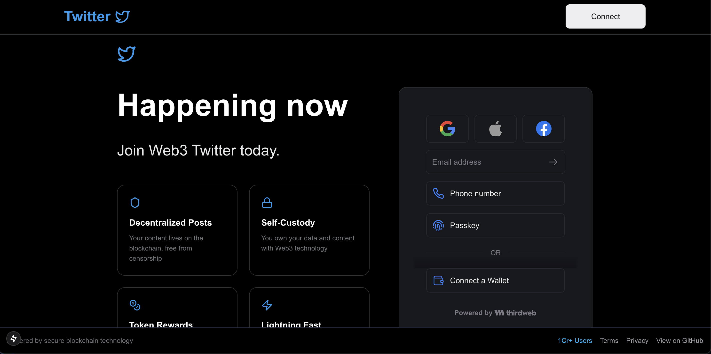
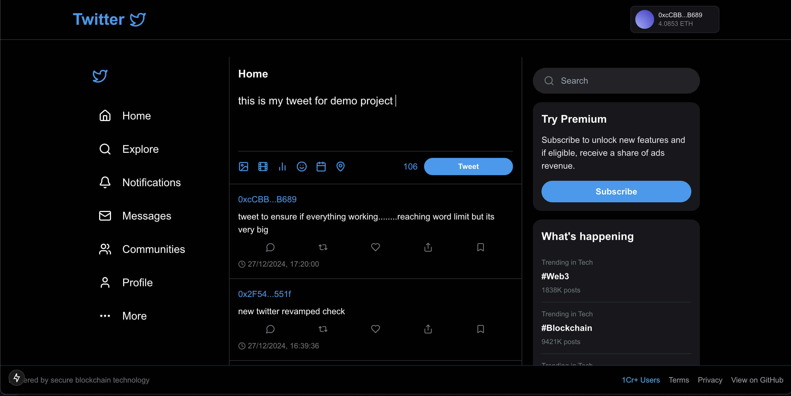
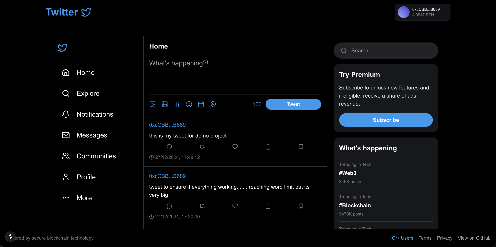
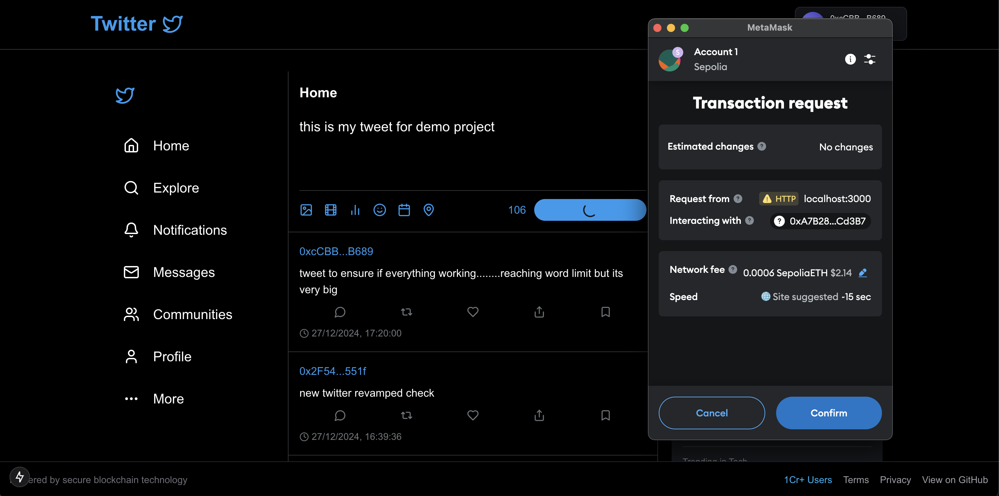
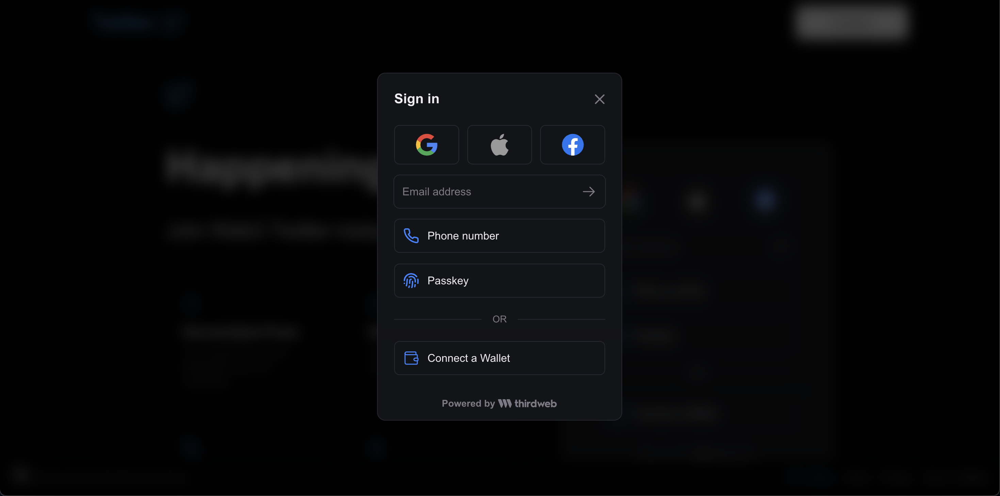
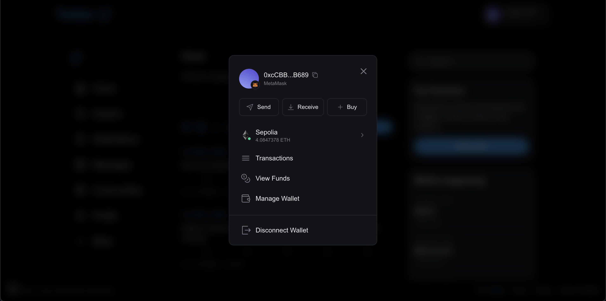
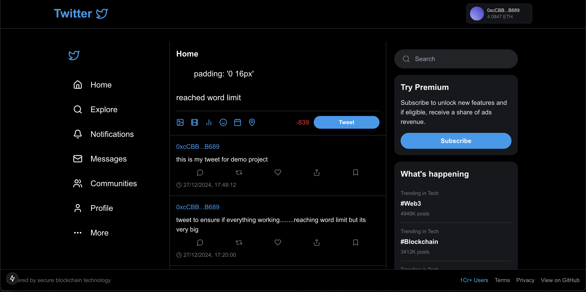

# Web3 Twitter

This is a decentralized social media platform inspired by Twitter, built using modern Web3 technologies. It allows users to connect their crypto wallets, post tweets, and interact with others in a censorship-resistant and blockchain-backed environment.



## 🚀 Features

- **Wallet Authentication**: Log in using your crypto wallet (e.g., MetaMask).
- **Post Tweets**: Publish messages securely on the blockchain.
- **140-Character Limit**: Tweets are limited to 140 characters, ensuring concise communication.
- **Decentralized Ownership**: All user-generated content is stored on-chain, providing ownership and immutability.




## 🛠️ Tech Stack

### Frontend
- **Next.js**: Server-side rendering and dynamic routing.
- **TypeScript**: Type-safe development for scalability.
- **Tailwind CSS**: Modern, responsive UI design.
- **Thirdweb**: Simplified Web3 integration for wallet connection and contract interaction.



### Backend / Smart Contracts
- **Solidity**: Smart contracts for handling tweets and interactions.
- **Hardhat**: Development and deployment framework for Ethereum-compatible networks.

### Deployment
- **Smart Contracts**: Deployed on an Ethereum-compatible blockchain (e.g., Polygon or Ethereum testnets).

---




## 📦 Installation

Follow the steps below to run the project locally:

### Prerequisites
- **Node.js** (v16+)
- **npm** or **yarn**
- **MetaMask** (or another Web3 wallet)
- **Hardhat** installed globally

### Clone the Repository
```bash
git clone https://github.com/your-username/decentratweet.git
cd decentratweet
```

### Install Dependencies
```bash
npm install
```

### Configure Environment Variables
Create a `.env.local` file in the root directory and add the following variables:
```env
NEXT_PUBLIC_THIRDWEB_KEY=your-thirdweb-key
```

### Compile Smart Contracts
Navigate to the `contracts/` directory and run:
```bash
npx thirdweb deplot -k SECRET_KEY
```


### Deploy Smart Contracts
Deploy your contracts to an Ethereum-compatible testnet (e.g., Goerli, Mumbai):
```bash
npx hardhat run scripts/deploy.js --network sepolia
```
Copy the deployed contract address and update the frontend configuration.

### Run the Development Server
Start the application locally:
```bash
npm run dev
```
Visit `http://localhost:3000` in your browser.

---

## 🤝 Contribution

Contributions are welcome! Follow these steps:

1. Fork the repository.
2. Create a new branch (`feature/your-feature-name`).
3. Commit your changes and push to the branch.
4. Open a pull request.

---


## 📞 Contact

For questions or suggestions, feel free to reach out
